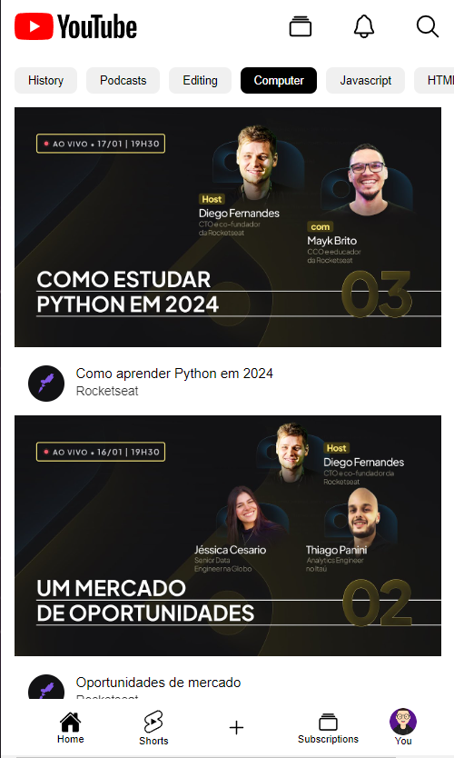

<h1 align="center">HTML e CSS na Prática 02</h1>

  
  

  <a href="#-tecnologias">Tecnologias</a>&nbsp;&nbsp;&nbsp;|&nbsp;&nbsp;&nbsp;
  <a href="#-projeto">Projeto</a>&nbsp;&nbsp;&nbsp;

 

  

<h4 align="center">
  
  [GitHub Pages](https://gabrielcenteiofreitas.github.io/estudos-rocketseat-html_css_pratica_02/)
</h4>

## 🚀 Tecnologias

Esse projeto foi desenvolvido com as seguintes tecnologias:

- HTML
- CSS

## 💻 Projeto

Projeto de um Fake Youtube desenvolvido no evento "HTML e CSS na Prática" da Rocketseat com o objetivo de treinar e aprimorar habilidades.
